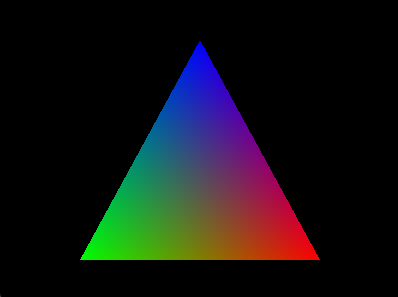

# Makefiles samples

This repo contains templates of makefiles to compile C/C++ source files using MinGW

> In development

## Contents table

1. [getting started](#getting-started)
1. [building project](#building-a-project)
1. [building a project on windows](#building-a-project-on-windows)
1. [building a project on linux](#building-a-project-on-linux)
1. [how to use](#how-to-use)
1. [recipes](#recipes)
    - [run](#run)
    - [build](#build)
    - [cbuild](#cbuild)
    - [compile](#compile)
    - [clean](#clean)
    - [template-version](#template-version)
    - [%.o](#o)
    - [%.exe](#exe)

1. [customization](#customization)

## Getting started

First you must be certify that `MinGw` or `make`, and `C/C++` compiler are installed.

To compile your C/C++ code using Makefile you must be copy the template on `<project-dir>`. You can modify the variables and recipes to better compile your code or project and to invoke the `mingw32-make` or `make` using a recipe.

To build and run a simple file you can use the target `%.exe` writing the basename of file with `.exe` suffix. This target will do with the make compiling and, if no have problems in compilation, run the file. For example to build and execute a OpenGl program, that draw a triangle in the screen, named `triangle.c`, you can use `triangle.exe`. [See more in How to use](#how-to-use)

```sh
cp .\Makefile <project-dir>
mingw32-make triangle.exe
```

Output:


### Building a project

Another way to compile projects, files or libs is using the `build` and `run` recipes, which will compile your code and all dependencies and run the code.

To use this recipe first you must modify the makefile variables. You can choose default compiler, program name, build target, file directory and build flags, etc. [See more in customization](#customization)

```Makefile
CC := gcc # C default compiler
APPNAME := main # Program output name
TARGET := main.c # Build target
SRC_DIR := ./src # Source directory
INCLUDE_DIR := ./include # Headers directory
EXTRA_FLAGS := -fopenmp # extra flags to compilation
```

When to compiler anything the result will be:

```sh
gcc -I ./include -fopenmp ./src/main.c -o ./bin/main.exe
```

### Building a project on Windows

On Windows systems you must be use `mingw32-make` to compile program or project. Or you can use a batch script to call `mingw32-make.exe` with alias `make`, like e Linux systems. For this you should be copy a `make.bat` on MinGw binaries folder `<MinGw-dir>/bin`.

```sh
cp .\make.bat C:/MinGw/bin
make template-version
```

```sh
>> mingw32-make template-version
>> v2.0.0
```

### Building a project on Linux

The makefile template went project to be executed in Windows systems by MinGw, It should be compatible with Linux system using directly `make`, however if necessary you can customize the recipes to use native fuctions of Linux.

#### Makefile

```Makefile
custom-recipe:
    INPUT = ""
    read INPUT
    if [$(INPUT) == "main.c"]; then \
        $(CC) $(INPUT) -o program.exe; \
        ./program.exe; \
    else \
        @echo "Not found"
    fi

```

#### shell

```sh
make custom-recipe
```

#### output

```sh
>> main.c
>> Hello World!
```

## How to use

To compile you project or file you must be call `mingw32-make` or `make` with a compilation recipe or target `make <recipe> <args>`.

```sh
make clean
make cbuild
make run
```

### Recipes

#### run

#### build

#### cbuild

#### compile

#### clean

#### template-version

#### %.o

#### %.exe

### Customization

You can customize the compilation proccess change or alter variables and recipes on Makefile

#### Program

##### APPNAME

##### TARGET

#### C Compiler

##### CC

##### CC_STD

##### CFLAGS

#### CPP Compiler

##### CXX

##### CXX_STD

##### CXXFLAGS

### FLAGS

#### OPTIONAL_CFLAGS

#### EXTRA_CFLAGS

#### INCLUDE_CFLAGS

### Directories

#### BIN_DIR

#### SRC_DIR

#### OBJ_DIR

#### LIB_DIR

#### INCLUDE_DIR

### Others

#### RM

#### HEADER_FILES

#### SOURCE_FILES

#### HXX_FILES

#### OBJ_FILES

#### C_OBJ

#### OBJ
